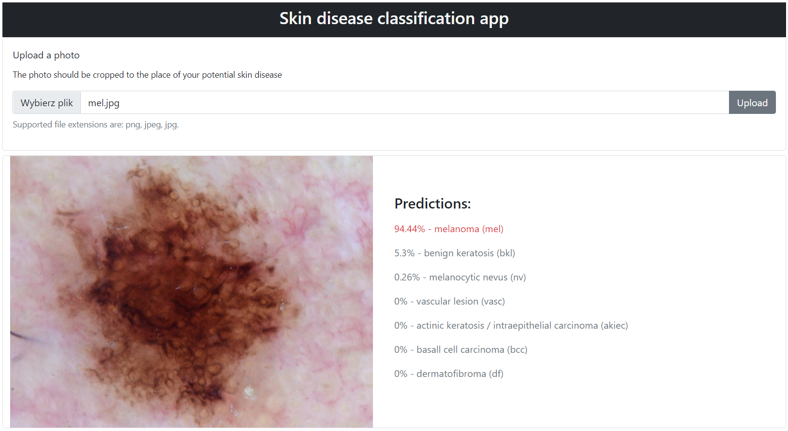
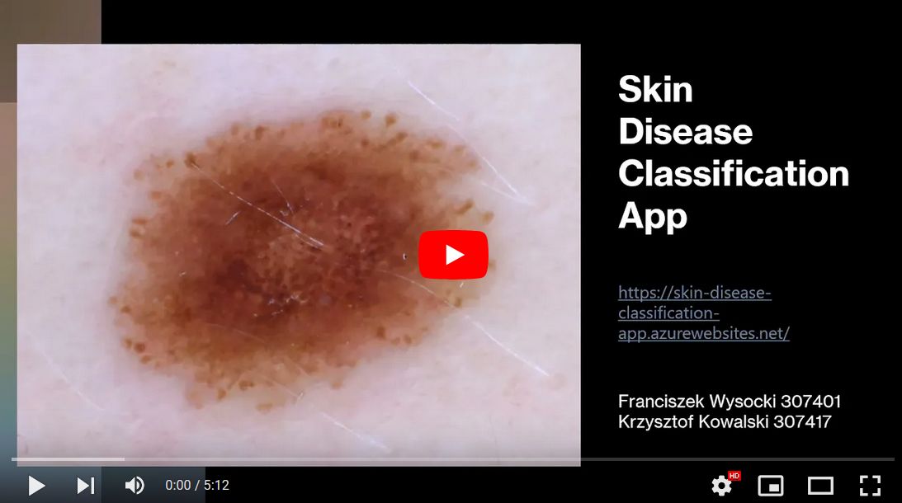
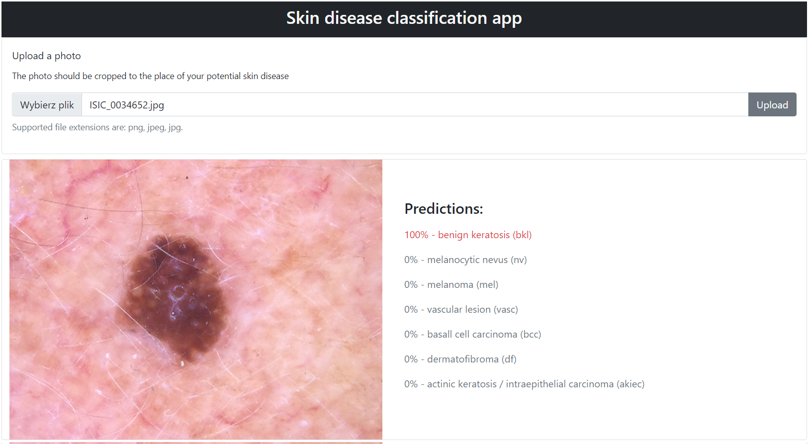
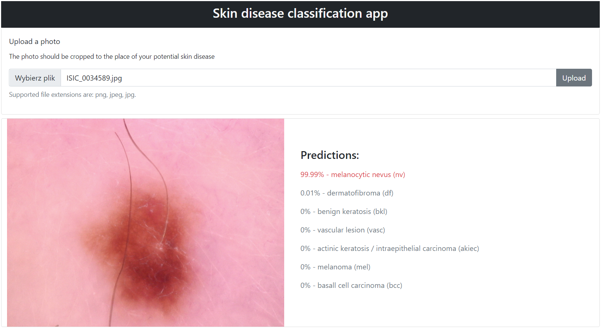

# Skin disease classification app

<a href="https://skin-disease-classification-app.azurewebsites.net" target="_blank">https://skin-disease-classification-app.azurewebsites.net</a>

## General information 

 // description

## Dataset

## Architecture

## Technologies used

## Features

## Demo

See a demo (in polish):

 

## Screenshots

Benign keratosis (bkl):

Melanocytic nevus (nv):

## Team

[Franciszek Wysocki](https://github.com/wysockif)

[Krzysztof Kowalski](https://github.com/KKofta)

