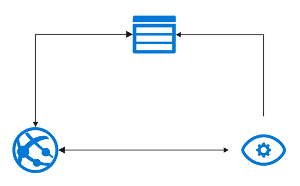

# Skin disease classification app

<a href="https://skin-disease-classification-app.azurewebsites.net" target="_blank">https://skin-disease-classification-app.azurewebsites.net</a>

---

## Table of Contents

- [General Information](#general-information)
- [Used Dataset](#used-dataset)
- [Used Technologies](#used-technologies)
- [Development process](#development-process)
- [Architecture Diagram](#architecture-diagram)
- [How does it work](#how-does-it-work)
- [Demo](#demo)
- [Screenshots](#screenshots)
- [Team](#team)

---

## General Information

Skin disease classification app is a web application which enables users to upload photos (mainly of their skin) and to receive a probability with which it is a certain skin disease. An aim of this project was to check if it is possible to classify skin diseases based on their photos, which could be a great option to improve predictions of diseases made by human. Developing this kind of technology could be very rewarding in terms of detecting, for instance cancer in its early stages, which could lead to more accurate and prospering treatment.

Tha app was created as a 2-week project for a class "Introduction to applications and solutions based on Artificial Intelligence". The theme of a project was to create an app which brings some innovation to this world and has a potential of bringing benefits for people.

---

## Used Dataset

- `HAM10000 dataset` from <a href="https://dataverse.harvard.edu/dataset.xhtml?persistentId=doi:10.7910/DVN/DBW86T">dataverse.harvard.edu/dataset.xhtml</a>.

It is a large collection of multi-source dermatoscopic images of common pigmented skin lesions.

---

## Used Technologies

- `Custom Vision Service - Azure`
- `Azure Storage`
- `Azure Web Services`
- `React.js 17.0.2`

---

## Development process

- Finding, acquiring and preparing data for a training model.
- Creation of prediction (classifying) system using one of Azure Cognitive Services - `Custom Vision`.
- Implementation of a frontend application using `React.js`.
- Connecting trained model with frontend application using `REST API` and `Azure Storage`.
- Deployment of application using `Azure Web Services`.

---

## Architecture Diagram

---

## How does it work

1. A user opens the web application (hosted in Azure App Service), then uploads a photo of a skin disease and
   clicks the Upload button.
2. The web application sends the image to Azure Blob Storage.
3. Azure Blob Storage returns a url of the uploaded resource.
4. The web application sends the image url to Custom Vision API.
5. Custom Vision API returns predictions.
6. The web application presents the predections.

---

## Demo

See a demo (in polish):

---

## Screenshots

Benign keratosis (bkl):

Melanocytic nevus (nv):

---

## Team

[Franciszek Wysocki](https://github.com/wysockif)

[Krzysztof Kowalski](https://github.com/KKofta)
